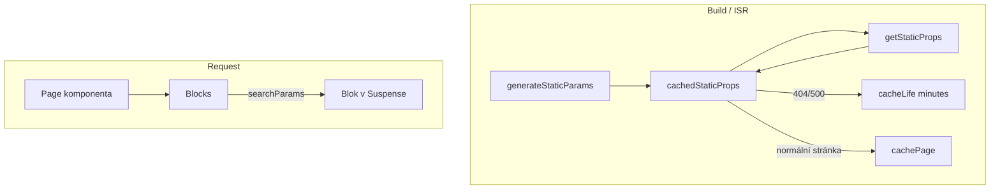

# Cache Components systém

Manuál pro implementaci a práci s cache component systémem v projektu.

## Úvod

Cache components v tomto projektu v základu **nic necachuje** – je na nás, jak to nastavíme. Systém využívá Next.js 16 Cache Components (`cacheComponents: true`) a vlastní helper funkce v `frontend/src/utils/cache/` pro práci s cache tagy a revalidací.

## Architektura



### Tok dat

1. **generateStaticParams** – předgeneruje cesty pro ISR (všechny stránky, články, lokality)
2. **cachedStaticProps** – funkce s `'use cache'`, volá `getStaticProps`; context má vždy `searchParams: {}` (ignorováno, jelikož se k searchParams lze dostat až v Suspense prostředí)
3. **Chybové stránky** (404, 500) – `cacheLife('minutes')` – 1 minuta (minimum dle Next.js dokumentace)
4. **Běžné stránky** – `cachePage(app)` – aplikuje cache tagy podle obsahu stránky
5. **searchParams** – předávají se do `Blocks` a dále do bloků; bloky, které je používají, musí být obaleny v `Suspense`

## Helper funkce

### tag.ts

- **`cacheTag(tag, id?)`** – nastaví cache tag pro danou entitu. Formát: `tag` nebo `tag-documentId`
- **`revalidateTag(tag, id?)`** – revaliduje cache pro daný tag
- **`TCacheTags`** – typ dostupných tagů: `article`, `article-category`, `built-form`, `menu`, `page`, `redirect`, `system-resource`, `template`, `web-setting`

### path.ts

- **`revalidatePath(path)`** – revaliduje konkrétní cestu
- **`revalidateAll()`** – revaliduje celý web (layout + page)

### page.ts

- **`cachePage(app)`** – aplikuje cache tagy na stránku podle obsahu:
  - Globální: menu, redirect, system-resource, web-setting
  - Stránka: page + documentId, rekurzivně bloky (form, template)
  - Dynamický obsah (item): article, article-category

## Tři způsoby načítání dat pro bloky

### 1. Skrz getStaticProps

Data se načítají v `getStaticProps` na serveru. Výsledek je dostupný v `app.blocksPropsMap` a globálně v aplikaci. **Načítání by nemělo mít vlastní cache** – cachuje se celé `getStaticProps` v rámci `cachedStaticProps`.

### 2. Přímo v bloku (server)

Data se načítají přímo v bloku na serveru. Pokud blok používá `searchParams` nebo `cookies`, musí být obalen v `Suspense` (viz Partial Prerender). Příklad: `ArticlesListBlock`.

### 3. Z klienta

Běžné načítání přímo z komponenty (loadMore, infinite scroll, atd.).

## searchParams a Partial Prerender

Stránka je předgenerována staticky. Bloky, které potřebují `searchParams` (např. filtr článků podle kategorie), se generují **on demand** dynamicky:

1. Blok obalíme v `Suspense` s fallbackem (např. loading stav)
2. Vnitřní server komponenta (`ArticlesListBlockServer`) přistupuje k `searchParams` a dynamicky donačítá data
3. Stránka je předgenerována, výpis článků se generuje dynamicky podle `?filter=categoryId`

Příklad struktury:

```tsx
// ArticlesListBlock.tsx
const ArticlesListBlock = async (props) => (
    <Suspense fallback={<ArticlesListBlockLoading />}>
        <ArticlesListBlockServer {...props} />
    </Suspense>
);

// Server.tsx – přistupuje k searchParams
const ArticlesListBlockServer = async ({ searchParams, ...rest }) => {
    const { filter } = (await searchParams) || {};
    // ... fetch articles by categoryId from filter
};
```

## Revalidace

### API api/revalidate

- **GET** `?force=1` – vynutí revalidaci celého webu
- **GET** `?tag=article&id=xyz` – revaliduje tag a konkrétní entitu
- **GET** `?path=/cesta` – revaliduje konkrétní cestu
- **POST** `{ model, entry }` – revalidace podle Strapi modelu a entry (voláno z webhooku)

### API api/elastic/indexItem

Webhook handler pro změny v CMS. Po reindexování položky v Elasticsearch automaticky revaliduje cache:
- Revaliduje tag pro danou entitu (např. `article`)
- Revaliduje tag ve formátu `tag-documentId` (např. `article-abc123`)

### Strapi webhook

Strapi volá `api/elastic/indexItem` při změně obsahu. Indexování a revalidace probíhají v jednom requestu.

## Přidání nového cache tagu

1. Přidat hodnotu do `TCacheTags` v `frontend/src/utils/cache/tag.ts`
2. V `cachePage` nebo `cacheBlocks` v `frontend/src/utils/cache/page.ts` přidat logiku pro nový typ obsahu
3. V `api/elastic/indexItem` – pokud je entita indexována, revalidace probíhá automaticky (type z provider.getApiKey())

## Konfigurace

### next.config.ts

```ts
cacheComponents: true,
cacheLife: {
    default: {
        stale: 30,        // Client cache 30 sekund
        revalidate: 3600, // Revalidace server cache každou hodinu
        expire: 31536000, // Expirace po 365 dnech
    },
},
```

### sklinet.config.json

- `ssg.revalidate` – hodnota pro revalidaci (používá se v getBlocksProps při non-static generation)
- `ssg.staticGeneration` – zda běží statická generace

## Debug

Pro testování si lze aktivovat env proměnné v `frontend/.env.example`:

- `NEXT_PUBLIC_ALLOW_CACHE_LOGS="1"` – logování nastavení cache tagů
- `NEXT_PUBLIC_ALLOW_REVALIDATE_LOGS="1"` – logování revalidace
- `NEXT_PUBLIC_ALLOW_FETCH_LOGS="1"` – logování fetch operací
