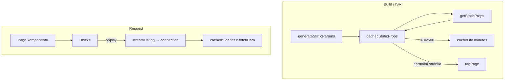

# Cache Components systém

Manuál pro implementaci a práci s cache component systémem v projektu.

## Úvod

Cache components v tomto projektu v základu **nic necachuje** – je na nás, jak to nastavíme. Systém využívá Next.js 16 Cache Components (`cacheComponents: true`) a vlastní helper funkce v `frontend/src/utils/cache/` pro práci s cache tagy a revalidací.

Každý helper žije ve vlastní složce jako `index.ts` + `index.test.ts`. Zdrojáky jsou obsáhle okomentované JSDocem – tenhle dokument je rozcestník, detaily a odůvodnění jsou přímo u kódu.

## Architektura


```mermaid
flowchart TD
    subgraph build [Build / ISR]
        GSP[generateStaticParams]
        GSP --> CSP[cachedStaticProps]
        CSP --> GSP2[getStaticProps]
        GSP2 --> CSP
        CSP --> |404/500| CL[cacheLife minutes]
        CSP --> |normální stránka| TP[tagPage]
    end
    subgraph request [Request]
        Page[Page komponenta]
        Page --> Blocks[Blocks]
        Blocks --> |výpisy| SL[streamListing → connection]
        SL --> FD[cached* loader z fetchData]
    end
```

### Tok dat

1. **generateStaticParams** – předgeneruje cesty pro ISR, pro každou lokalitu z `sklinet.config.json`
2. **cachedStaticProps** – funkce s `'use cache'`, volá `getStaticProps`; context má vždy `searchParams: {}` (ignorováno, jelikož se k searchParams lze dostat až v Suspense prostředí)
3. **Chybové stránky** (404, 500) – `cacheLife('minutes')` – 1 minuta (minimum dle Next.js dokumentace)
4. **Běžné stránky** – `tagPage(app)` – aplikuje cache tagy podle obsahu stránky
5. **Výpisy** (články, kategorie) – vlastní `Server.tsx` v `Suspense`, který **jako první** volá `streamListing()`

## Helper funkce

### tag/

Taxonomie cache tagů a obal nad `next/cache`.

- **`CacheType`** – všechny typy obsahu, které cache zná. Dělí se na:
  - **`LocalizedCacheType`** – typy s `pluginOptions.i18n.localized: true` ve Strapi: `page`, `article`, `article-category`, `built-form`, `menu`, `system-resource`, `template`, `web-setting`. Jejich tag **vždy nese lokalitu**.
  - **`GlobalCacheType`** – typy bez i18n: `icon`, `redirect`. Jejich tag lokalitu nenese nikdy.
- **`buildCacheTag(type, { id?, locale? })`** – jediné místo, které skládá tvar tagu: `{type}` → `{type}-{locale}` → `{type}-{id}` → `{type}-{id}-{locale}`. Lokalizovaný typ bez lokality vrací prázdný řetězec a zaloguje (nehodí výjimku, aby chybějící lokalita nemohla shodit render).
- **`cacheTag(type, { id?, locale? })`** – zápis; volatelné jen uvnitř `'use cache'` scope.
- **`revalidateCacheTag(type, { id?, locale? })`** – invalidace. Když u lokalizovaného typu chybí lokalita, **profoukne všechny nakonfigurované lokality** místo toho, aby revalidaci zahodila (webhook ze Strapi může přijít neúplný).
- **`isKnownCacheType(model)`** – type guard pro vstup z revalidační route; neznámý model končí `400`, ne tichým `200`.
- **`SUBMISSION_MODELS`** – typy, které existují jen pro odeslané formuláře (`contact-message`, `newsletter-subscriber`). Webhook pro ně se potvrdí a zahodí.

> `tag/index.test.ts` čte schémata z `cms/src/api/**` a `cms/src/extensions/**` a shodí se, pokud ve Strapi přibude content type, který cache nezná, nebo pokud se u některého překlopí příznak `localized`. Po zásahu do CMS tedy spusť `npm run test`.

### path/

- **`revalidatePath(path)`** – revaliduje konkrétní cestu
- **`revalidateAll()`** – revaliduje celý web (layout + page)

### page/

- **`tagPage(app)`** – aplikuje cache tagy na stránku podle obsahu:
  - Strukturální: `web-setting`, `menu`, `redirect`, `system-resource`
  - Stránka: `page` + `page-{documentId}`, rekurzivně bloky (form, template)
  - Dynamický obsah (`app.item`): `article`, `article-category`
- **`tagBlocks(node, locale)`** – projde payload a otaguje každý záznam, který si zaslouží vlastní entity tag
- **`tagNotFoundPage(locale)`** – tagy pro request, který nic nenašel
- **`isSystemPageSlug(slug)`** – pozná systémové CMS stránky (404, 500), které nesmí odpovědět 200 na vlastní URL

> **Kolektivní tagy výpisů** (`article-{locale}`, `article-category-{locale}`) se tady **nepíšou** – patří k loaderům výpisů, ne ke skeletu stránky.

### cachedStaticProps/ · cachedMetadata/ · cachedGlobalMetadata/

- **`cachedStaticProps(slug, locale)`** – `'use cache'` obal nad `getStaticProps`; 404/500 dostane `cacheLife('minutes')`, běžná stránka `cacheLife('default')`
- **`cachedMetadata(slug, locale)`** – metadata stránky
- **`cachedGlobalMetadata(locale)`** – globální SEO z `webSetting`
- **`cachedAppRedirect(redirectPath)`** – přesměrování z CMS

### preview/

- **`bypassCacheIfPreview(preview, readCached, readFresh)`** – v draft módu nesmí vzniknout `'use cache'` záznam; editor musí vidět to, co právě uložil. `preview` je tedy přepínač větve, ne součást cache klíče.

### streamListing/

- **`streamListing()`** – `await connection()`, čímž odsune komponentu z prerenderu do request time.

  Samotný `<Suspense>` **nestačí**: cache záznam route bere **minimum** `cacheLife` a **sjednocení** tagů všech scopů, které se během jejího prerenderu vyřešily. Blok s výpisem by tak route předal svůj kolektivní tag `article-{locale}` a jedna publikace článku by zahodila i skelet homepage. **Volej ho jako úplně první věc v `Server.tsx`, před jakýmkoli čtením dat.**

### fetchData/

Dvojice loaderů pro výpisy – nekešovaná (`index.ts`) a kešovaná (`cached.ts`):

- **`fetchArticlesList` / `cachedArticlesList`**
- **`fetchArticleCategories` / `cachedArticleCategories`**

Kešované varianty píšou kolektivní tag (`article-{locale}`) a vrací syrové záznamy – `webSetting` zůstává mimo cache klíč a dosazuje se až v `Server.tsx`.

### memory/

Podklady pro `/api/memory` – snapshot RSS / JS heapu / off-heap bufferů proti limitu in-memory cache a HTML report nad ním. Slouží k ladění paměti produkční instance.

## Tři způsoby načítání dat pro bloky

### 1. Skrz getStaticProps

Data se načítají v `getStaticProps` na serveru. Výsledek je dostupný v `app.blocksPropsMap` a globálně v aplikaci. **Načítání by nemělo mít vlastní cache** – cachuje se celé `getStaticProps` v rámci `cachedStaticProps`.

### 2. Přímo v bloku (server)

Data se načítají přímo v bloku na serveru. Pokud blok používá `searchParams` nebo `cookies`, musí být obalen v `Suspense` a jeho `Server.tsx` musí začínat voláním `streamListing()`. Příklad: `ArticlesListBlock`.

### 3. Z klienta

Běžné načítání přímo z komponenty (loadMore, infinite scroll, atd.).

## searchParams a Partial Prerender

Stránka je předgenerována staticky. Bloky, které potřebují `searchParams` (např. filtr článků podle kategorie), se generují **on demand** dynamicky:

1. Blok obalíme v `Suspense` s fallbackem (např. loading stav)
2. Vnitřní server komponenta (`ArticlesListBlockServer`) zavolá `streamListing()`, teprve pak sáhne na `searchParams` a dynamicky donačte data
3. Stránka je předgenerována, výpis článků se generuje dynamicky podle `?filter=categoryId`

Příklad struktury:

```tsx
// ArticlesListBlock.tsx
const ArticlesListBlock = async (props) => (
    <Suspense fallback={<ArticlesListBlockLoading />}>
        <ArticlesListBlockServer {...props} />
    </Suspense>
);

// Server.tsx – nejdřív streamListing, až potom searchParams
const ArticlesListBlockServer = async ({ searchParams, ...rest }) => {
    await streamListing();

    const { filter } = (await searchParams) || {};
    // ... fetch articles by categoryId from filter
};
```

> Samotná `Page` komponenta nesmí číst žádné vlastní dynamické API: React odmítne strom, který odsouvá render ve svém kořeni a zároveň má odsunuté sloty pod sebou. Draft mód se proto řeší uvnitř `cachedStaticProps`, mimo jeho `'use cache'` scope.

## Revalidace

Obě metody `api/revalidate` vyžadují hlavičku `x-revalidate-secret` shodnou s `REVALIDATE_SECRET`. Výjimka: v `NODE_ENV=development` je `GET` otevřený.

### API api/revalidate

- **GET** `?tag=article&id=xyz&locale=cs` – revaliduje kolektivní i entity tag; neznámý `tag` vrací `400`
- **GET** `?path=/cesta` – revaliduje konkrétní cestu
- **GET** `?force=1` – vynutí revalidaci celého webu (**jen ve vývoji**)
- **POST** `{ model, entry }` – revalidace podle Strapi modelu a entry (voláno z webhooku); lokalita se bere z `entry.locale`, id z `entry.documentId`

### API api/elastic/indexItem

Webhook handler pro změny v CMS. Po reindexování položky v Elasticsearch automaticky revaliduje cache:
- Revaliduje kolektivní tag pro danou entitu (např. `article`)
- Revaliduje entity tag (např. `article-abc123`)

Lokalita se tu nepředává – v tomhle místě není známá, takže `revalidateCacheTag` tagy profoukne napříč všemi lokalitami z `sklinet.config.json`.

### Strapi webhook

Strapi volá `api/elastic/indexItem` při změně obsahu. Indexování a revalidace probíhají v jednom requestu.

## Přidání nového cache tagu

1. Přidat hodnotu do `LocalizedCacheType` nebo `GlobalCacheType` **a do odpovídající runtime sady** (`LOCALIZED_TYPES` / `GLOBAL_TYPES`) v `frontend/src/utils/cache/tag/index.ts`
2. V `tagPage` v `frontend/src/utils/cache/page/index.ts` přidat logiku pro nový typ obsahu
3. Spustit `npm run test` – test v `tag/index.test.ts` ověří, že sada odpovídá schématům ve Strapi
4. V `api/elastic/indexItem` – pokud je entita indexována, revalidace probíhá automaticky (type z `provider.getApiKey()`)

## Konfigurace

### next.config.ts

```ts
cacheComponents: true,
cacheLife: {
    default: {
        stale: 86400,      // 1 den
        revalidate: 2592000, // 30 dní
        expire: 31536000,  // 1 rok
    },
    external: {
        stale: 300,        // 5 minut
        revalidate: 1800,  // 30 minut
        expire: 3600,      // 1 hodina
    },
},
```

Obsah z CMS jede na profilu `default` – čerstvost zajišťují tagy profouknuté webhookem po publikaci, TTL je jen záchranná brzda, proto je dlouhé. `external` je krátké pro data třetích stran, která žádný webhook nemají.

### sklinet.config.json

- `i18n.locales` / `i18n.defaultLocale` – lokality, přes které `revalidateCacheTag` fanoutuje, když webhook nepošle lokalitu
- `ssg.revalidate` – hodnota pro revalidaci (používá se v getBlocksProps při non-static generation)
- `ssg.staticGeneration` – zda běží statická generace

## Debug

Pro testování si lze aktivovat env proměnné v `frontend/.env.example`:

- `NEXT_PUBLIC_ALLOW_CACHE_LOGS="1"` – logování nastavení cache tagů
- `NEXT_PUBLIC_ALLOW_REVALIDATE_LOGS="1"` – logování revalidace
- `NEXT_PUBLIC_ALLOW_FETCH_LOGS="1"` – logování fetch operací

Dále je k dispozici `/api/memory` – HTML report o paměti procesu proti limitu in-memory cache.
